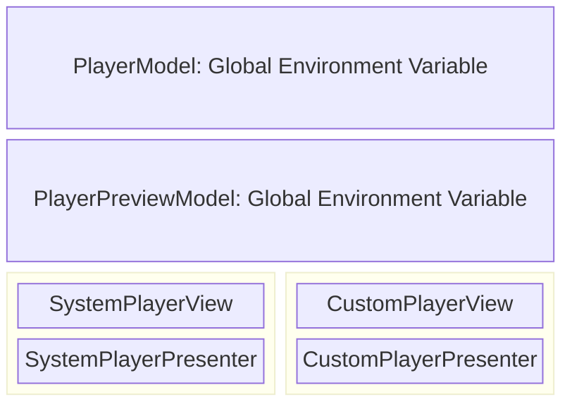
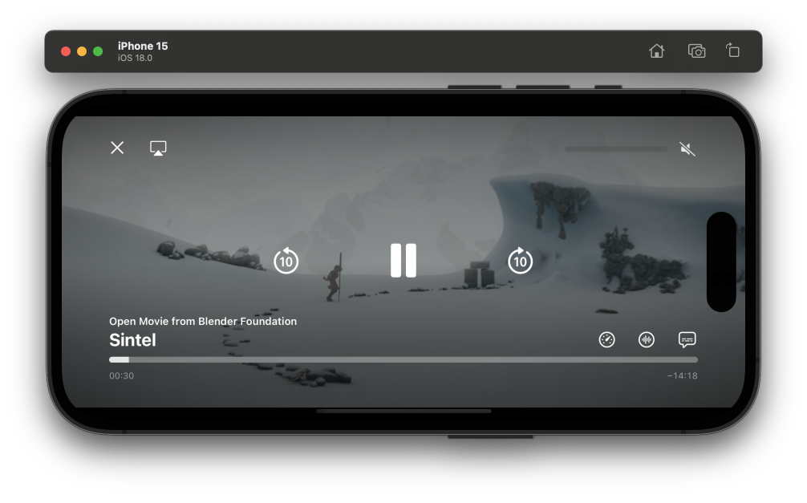
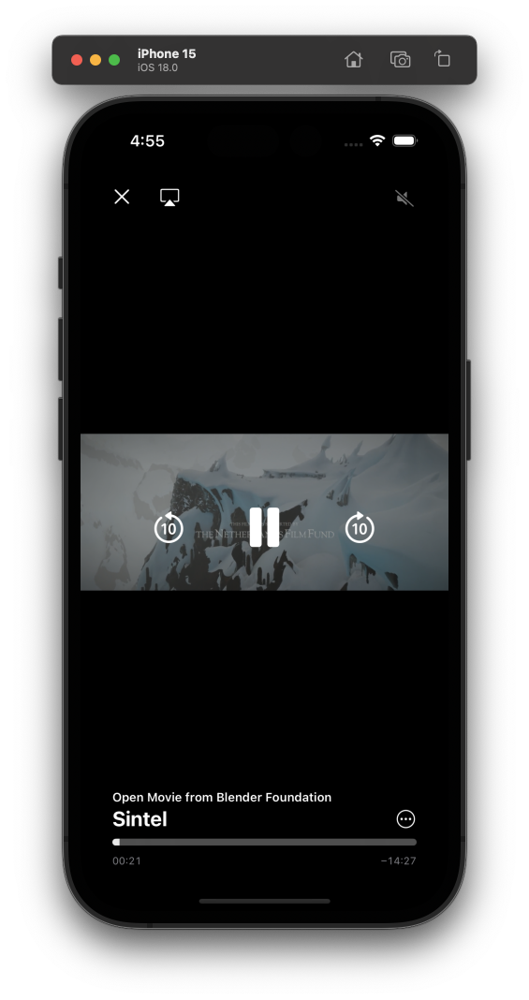
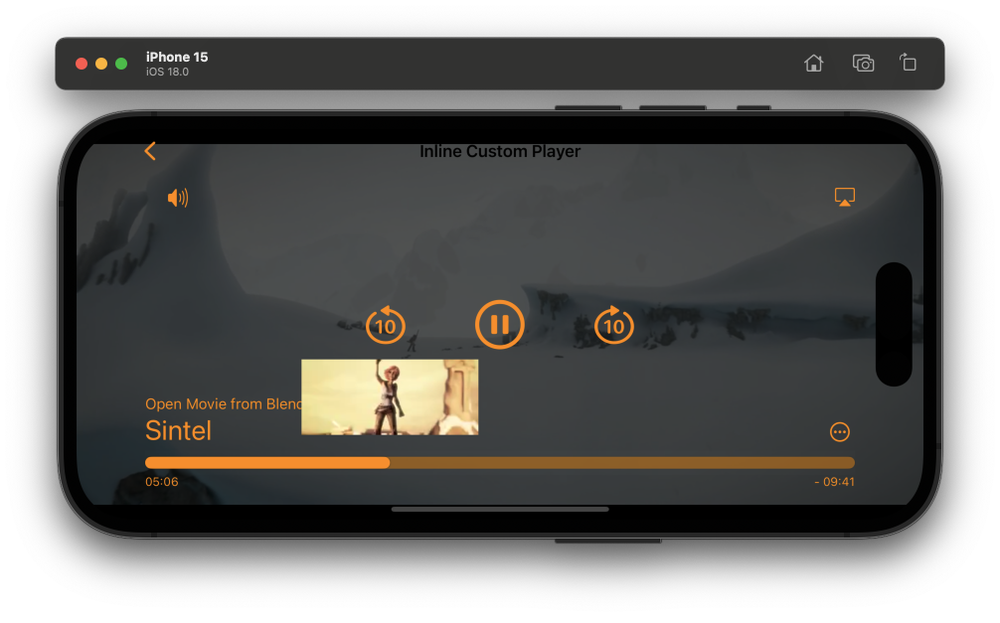
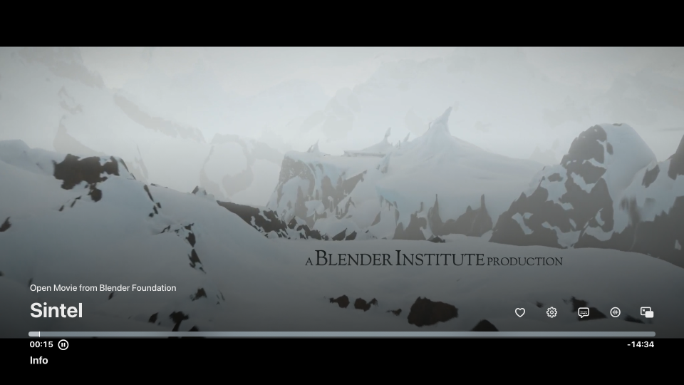
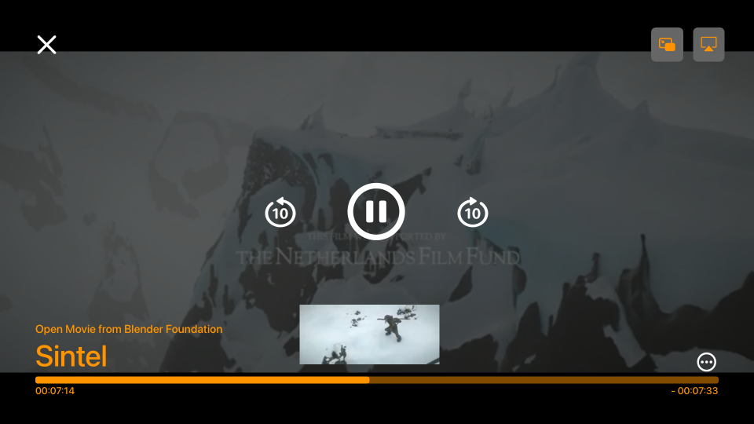

#  MPlayerKit

## A Customizable Player System in SwiftUI for iOS / tvOS 

MPlayerKit is an open-source, customizable SwiftUI video player framework designed for seamless integration on iOS and tvOS. It supports both system and custom player views, making it easy to add video playback functionality with full control over UI and player behavior.

## Architecture



### PlayerModel
**PlayerModel** is a global environment variable, accessible throughout the view hierarchy. To access it, use the following code snippet:

```swift
struct YourView: View { 
    @Environment(\.playerModel) private var playerModel
    //...
}
```  

**Responsibilities of PlayerModel:**
- Manage **AVPlayer** (loading, playing, pausing, and seeking).
- Publish player state via **Combine**.
- Manage video asset subtitles and audio tracks.
- Handle audio sessions, including interruptions.
- Update Media Player Now Playing Metadata.

**Subscribed States:**
- Player state (playing, paused, buffering)
- Current playable item (conforms to `Playable` protocol)
- Duration and current time
- Video aspect ratio
- Presentation mode (none, fullscreen, inline)
- Picture-in-Picture (PiP) status and availability
- Available subtitles, audio, and languages

To subscribe to `PlayerModel` states, use this method:

```swift
struct YourView: View { 
    @Environment(\.playerModel) private var playerModel
    @State private var playerState: PlayerState = .paused(reason: .userInitiated)

    var body: some View {
        content
        .onReceive(playerModel.$state.receive(on: DispatchQueue.main)) { newValue in
            playerState = newValue
        }
    }
}
```

### PlayerPreviewModel 
**PlayerPreviewModel** is a simplified version of `PlayerModel` for handling seeking previews. To access it, use:

```swift
struct YourView: View { 
    @Environment(\.playerPreviewModel) private var playerPreviewModel
    //...
}
```  

### SystemPlayerView 
**SystemPlayerView** displays an **AVPlayerViewController** within SwiftUI. It offers three callback closures:

- `prepare`: Called after **AVPlayerViewController** creation, allowing customization:
  
  ```swift
  SystemPlayerView(prepare: { avPlayerController in
      avPlayerController.requiresLinearPlayback = true
  })
  ```

- `onTimeChange`: Triggered every second during playback.
- `onStateChange`: Invoked on AVPlayer state changes.

### SystemPlayerPresenter
**SystemPlayerPresenter** displays `SystemPlayerView` in fullscreen with the same callback closures. Example usage:

```swift
struct YourView: View { 
    @Environment(\.playerModel) private var playerModel

    var body: some View {
        Button(action: {
            Task {
                await playerModel.load(vod)
                playerModel.presentation = .fullscreen(autoplay: true)
            }
        }) {
            Text("Play Video")
        }
        .systemPlayerFullScreenPresenter(
            prepare: { avPlayerController in /* prepare the AVPlayerController */ }
            onTimeChange: { time in /* handle time change */ },
            onStateChange: { state in /* handle state change */ }
        )
    }
}
```

### CustomPlayerView
**CustomPlayerView** utilizes **AVPlayerLayer** to render video, allowing custom control overlays:

```swift
CustomPlayerView(controls: { playerModel in
    CustomControlsView(playerModel)
}, prepare: { playerLayer in /* prepare the AVPlayerlayer */ }, 
   onTimeChange: { time in /* handle time change */ },
   onStateChange: { state in /* handle state change */ })
```

### CustomPlayerPresenter
**CustomPlayerPresenter** displays `CustomPlayerView` in fullscreen. Example usage:

```swift
struct YourView: View { 
    @Environment(\.playerModel) private var playerModel

    var body: some View {
        Button(action: {
            Task {
                await playerModel.load(vod)
                playerModel.presentation = .fullscreen(autoplay: true)
            }
        }) {
            Text("Play Custom Video")
        }
        .customPlayerFullScreenPresenter(
            prepare: { playerLayer in /* prepare the AVPlayerlayer */ }, 
            onTimeChange: { time in /* handle time change */ },
            onStateChange: { state in /* handle state change */ }
        )
    }
}
```

## Setup 

1. Clone the repository.
2. Copy the `MPlayerKit` folder to your Xcode project.
3. Add **MPlayerKit** as a local Swift package.
4. In **Signing & Capabilities**, enable **Audio, AirPlay, and Picture in Picture** and **Background Processing**.
5. Import **MPlayerKit** in your Swift code to start using it.

## Demo Project

A demo Xcode project is included in the repository, showcasing **SystemPlayerView** and **CustomPlayerView** on both iOS and tvOS.

### iOS
#### System Player View


#### Custom Player View



### tvOS



## Communication
Please use GitHub issues for bug reports, feature requests, and general inquiries and discussions.

## License
This project is licensed under the MIT License.

## Support 
If you find MPlayerKit helpful, consider buying me a coffee! ☕ 

[](https://www.paypal.com/biz/profile/wyndot)
