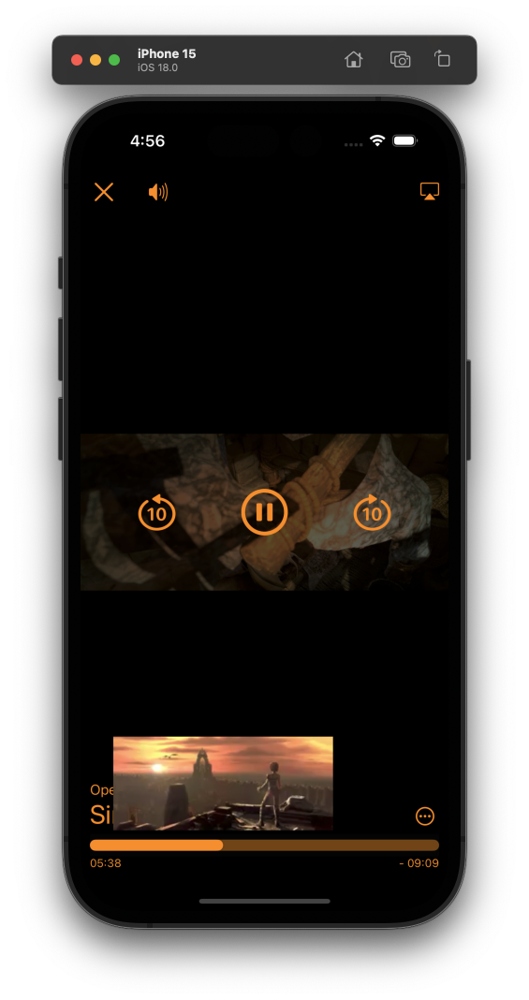

#  MPlayerKit 
## A Complete Player System in SwiftUI for iOS / tvOS 
## Architecture 

### PlayModel
**PlayerModel** is a global environment variable definded with name **playerModel**. It can be accessed from any where in the view hierarchy with the following code snippet.
```
struct YourView: View { 
    @Environment(\.playerModel) private var playerModel
    ...
}
```  
The responsibilities of the **PlayerModel** is following: 
* Load video asset into **AVPlayer**
* Monitor and publish (via **Combine**) the state of **AVPLayer** 
* Play, Pause and Seek the **AVPlayer**
* Handle the audio session of the playback including the interruption 
* Publish the Media Player Now Playing Metadata
* Handle the selection of video asset's **subtitle** and **andio**

The states of the **AVPLayer** client can subscribe to are following: 
* player state (playing, paused, buffering)
* current playable item 
* duration
* current time 
* video aspect ratio 
* player presentation mode (none, fullscreen, inline)
* PiP active 
* PiP possible 
* subtitle
* available subtitles
* audio
* availableAudios 
* languages
* availableLanguages 

To subscribe the states of the **PlayerModel**, use the following method
```
struct YourView: View { 
    @Environment(\.playerModel) private var playerModel
    @State private var playerState: PlayerState = .paused(reason: .userInitiated)

    var body: some View {
        content
        .onReceive(playerModel.$state.receive(on: DispatchQueue.main), perform: { newValue in
            playerState = newValue
        })
    }
}
```

### PlayPreviewModel 
**PlayerPreviewModel** is a global environemnt variable defined with name **playerPreviewModel**. It can be accessed as the same way to access the **playerModel** environment variable. 
```
struct YourView: View { 
    @Environment(\.playerPreviewModel) private var playerPreviewModel
    ...
}
```  
It's a simplified *PlayerModel** which has a single responsibility to handle the seeking preview. Given an thumbnail sized video url, it will load the video into **AVPlayer** and allow UI to preview the seeking position of the video. Here is how to show the preview in your view. 
```
struct YourView: View { 
    @State private var trackingState: TrackState = .idle
    var body: some View { 
        VStack { 
            ...
            Spacer() 
            VStack(alignment: .center, spacing: 4) {
                PlaybackPreviewView(trackingState: $trackingState)
                .frame(maxWidth: .infinity, maxHeight: 100)
                PlaybackTimeBar(trackingState: $trackingState)
                .frame(maxWidth: .infinity)
            }
        }
    }
}
```

### SystemPlayerView 
**SystemPlayerView** is presenting a **AVPlayerViewController** in the SwiftUI. There are three callback closures can be attached to it. They are defined as following. 
* prepare: ((_ controller: AVPlayerViewController) -> Void)
    
    This will be called after the AVPlayerViewController has been created and before it is presented to the UI. Client can use this callback closure to prepare and customize the AVPlayerViewController before present it. For example: 
    ```
    SystemPlayerView(prepare: { avPlayerController in
                avPlayerController.requiresLinearPlayback = true
            })
    ```
    or on tvOS, you can do more customization via this callback, for example 
    ```
    SystemPlayerView(prepare: { avPlayerController in
                avPlayerViewController.transportBarCustomMenuItems = [favoriteAction, menu]
            })
    ```
* onTimeChange: ((_ time: CMTime) -> Void)

    This will be called every second while the playback is playing 

* onStateChange: ((_ state: PlayerState) -> Void)

    This will be called whenever the **AVPlayer** State changed. Client can use this callback closure to handle the analytics. The PlayerState is defined as following. As you can see, it will pass the reason for each state to make it easier for analytic tracking.  
    ```
    public enum PlayerState {
        case playing
        case paused (reason: PlayerPauseReason)
        case buffering(reason: PlayerBufferingReason)
    }

    public enum PlayerPauseReason {
        case userInitiated
        case interrupted
        case endOfMedia
        case error(Error)
    }

    public enum PlayerBufferingReason {
        case unknown
        case toMinimizeStalls
        case evaluatingBufferRate
        case noItemToPlay
        case waitingForCoorindatedPlayback
    }
    ```
### SystemPlayerPresenter
**SystemPlayerPresenter** is a full screen cover presenter to present the **SystemPlayerView**. It has all three callback closures which **SystemPlayerView** has. Here is how to present it in your view. 
```
struct YourView: View { 
    @Environment(\.playerModel) private var playerModel
    @Environment(\.playerPreviewModel) private var playerPreviewModel

    var body: some View { 
        Button(action: { 
            Task { 
                await playerModel.load(vod)
                playerModel.presentation = .fullscreen(autoplay: true)
                Task { 
                    await playerPreviewModel.load(vod)  // vod is conform with Playable protocol which has a preview asset URL 
                }
            }
        }, label: { 
            buttonImage 
        })
        .systemPlayerFullScreenPresenter(prepare: { avPlayerViewController in
            logger.debug("prepareCustomPlayerView: \(String(describing: avPlayerViewController))")
#if os(tvOS)
            setupAVPlayerViewController(avPlayerViewController)
#endif
        }, onTimeChange: { time in
            logger.debug("onTimeChange: \(String(describing: time))")
        }, onStateChange: { state in
            logger.debug("onStateChange: \(String(describing: state))")
        })
    }
}
```

### CustomPlayerView
**CustomPlayerView** is using **AVPlayerLayer** to render the video. It allows to create your own custom controls for the player. To create a **CustomPlayerView** with your own controls, you can code as following. 
```
CustomPlayerView(controls: { playerModel in
                CustomControlsView(playerModel) 
            }, prepare: { playerLayer in
                logger.debug("prepareCustomPlayerView: \(String(describing: playerLayer))")
            }, onTimeChange: { time in
                logger.debug("onTimeChange: \(String(describing: time))")
            }, onStateChange: { state in
                logger.debug("onStateChange: \(String(describing: state))")
            })
```
As you can it also has three callback closures. They are same as **SystemPlayerView** and **SystemPlayerPresenter** except that the **prepare** is passing with an **AVPlayerLayer** instead of the **AVPlayerViewController** 

### CustomPlayerPresenter
**CustomPlayerPresenter** is similar to the **SystemPlayerPresenter** instead presenting the **CustomPlayerView** in a full screen cover. Here is how to use it. 
```
struct YourView: View { 
    @Environment(\.playerModel) private var playerModel
    @Environment(\.playerPreviewModel) private var playerPreviewModel

    var body: some View { 
        Button(action: { 
            Task { 
                await playerModel.load(vod)
                playerModel.presentation = .fullscreen(autoplay: true)
                Task { 
                    await playerPreviewModel.load(vod)  // vod is conform with Playable protocol which has a preview asset URL 
                }
            }
        }, label: { 
            buttonImage 
        })
        .customPlayerFullScreenPresenter(controls: { playerModel in
            CustomControlsView(playerModel)        // You can provide your own controls view here 
        }, prepare: { avPlayerViewController in
            logger.debug("prepareCustomPlayerView: \(String(describing: avPlayerViewController))")
#if os(tvOS)
            setupAVPlayerViewController(avPlayerViewController)
#endif
        }, onTimeChange: { time in
            logger.debug("onTimeChange: \(String(describing: time))")
        }, onStateChange: { state in
            logger.debug("onStateChange: \(String(describing: state))")
        })
    }
}
```
## Setup 
**MPlayerKit** is in a Swift Package. 
1. Clone this repository. 
1. Copy the folder **MPlayerKit** into your XCoder project folder. 
1. Go to your XCode project, Find the Package Dependencies tab in your Project. Click `+` to add the dependency 
1. In the popup Swift Package Manager dialog, click `Add Local...` button and choose the `MPlayerKit` folder. 
1. In your Xcode target, find the `General` tab, then find the `Frameworks, Libraries, and Embedded COntent` section, add the `MPlayerKit` if it's not there yet. 
1. In your Xcode target, find the `Signing & Capabilities` tab, then make sure you checked the `Audio, AirPlay, and Picture in Picture` and `Background processing` in the `Background Modes` section 
1. Import the `MPlayerKit` in your Swift file and enjoy your coding. :) 

## Demo 
There is demo Xcode project in the respository. Here is some screenshots from the demo. 
### iOS 
#### System Player View 


#### Custom Player View 


### tvOS 


## Communication: 
* GitHub issues: Bug reports, feature requests, setup issues, thoughts, etc. 

## License
MIT license 